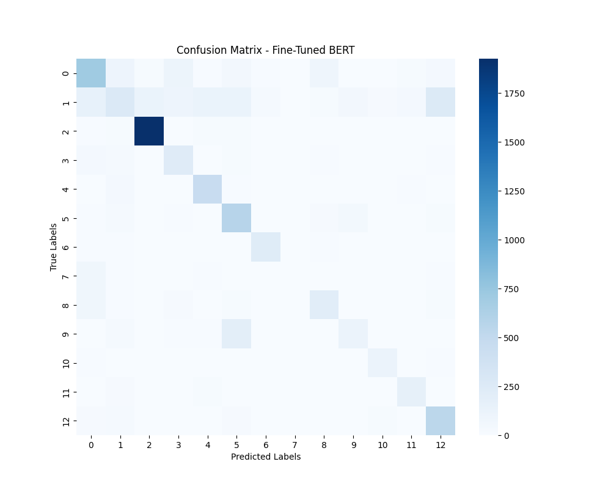

# Turkish News Classification (BERT)

This project contains a high-performance text classification model for Turkish news articles, developed using the Hugging Face Transformers library. The model is a fine-tuned version of `dbmdz/bert-base-turkish-cased` and is capable of classifying news into 13 different categories.

## 🚀 Features

-   **State-of-the-Art Architecture**: Built upon the `dbmdz/bert-base-turkish-cased` model for superior contextual understanding of the Turkish language.
-   **End-to-End Workflow**: Includes scripts for training, evaluation, and interactive prediction.
-   **Detailed Performance Analysis**: Automatically generates and saves a classification report and a confusion matrix to assess model performance.

## 📊 Performance

The model was evaluated on a test set, achieving the following results:

-   **Overall Accuracy**: 66%
-   **Macro F1-Score**: 58%

### Classification Report

The table below shows the precision, recall, and F1-score for each category. It highlights the model's strengths and weaknesses across different topics. For instance, the model is exceptionally good at identifying "spor" (sports) news, but struggles with more ambiguous categories like "yaşam" (life).

```
              precision    recall  f1-score   support

      güncel       0.62      0.61      0.61      1169
       genel       0.43      0.20      0.28      1334
        spor       0.92      0.96      0.94      2000
     siyaset       0.47      0.65      0.55       370
     magazin       0.69      0.83      0.75       558
       dünya       0.55      0.77      0.64       745
      sağlık       0.79      0.83      0.81       277
       yaşam       0.00      0.00      0.00       129
     türkiye       0.55      0.56      0.55       388
      planet       0.45      0.30      0.36       391
   teknoloji       0.67      0.77      0.72       154
kültür-sanat       0.67      0.72      0.69       231
     ekonomi       0.58      0.83      0.68       653

    accuracy                           0.66      8399
   macro avg       0.57      0.62      0.58      8399
weighted avg       0.64      0.66      0.64      8399
```

### Confusion Matrix

The confusion matrix below visualizes the model's predictions versus the actual labels. The diagonal line represents correct predictions.



## 📚 Categories

The model classifies news articles into the following 13 categories:
`güncel`, `genel`, `spor`, `siyaset`, `magazin`, `dünya`, `sağlık`, `yaşam`, `türkiye`, `planet`, `teknoloji`, `kültür-sanat`, `ekonomi`.

## 🛠️ Workflow and Usage

### 1. Installation

First, clone the project and install the required dependencies.

```bash
# Clone the repository (if you haven't already)
git clone <repository-url>
cd <repository-name>/v2_bert

# Create a virtual environment (recommended)
python -m venv venv
source venv/bin/activate  # On Windows use `venv\Scripts\activate`

# Install dependencies
pip install -r requirements.txt
```

### 2. Training

To train the model on your own dataset, run the training script. The script will automatically save the best-performing model to the `model/fine_tuned_bert/` directory.

```bash
python train_bert_finetune.py
```

### 3. Evaluation

After training, you can evaluate the model's performance on the test set. This script generates the `confusion_matrix.png` and `classification_report.txt` inside the `results/` folder.

```bash
python visualize_model.py
```

### 4. Prediction

To classify new headlines or text interactively, use the `predict_news.py` script.

```bash
python predict_news.py
```
The script will prompt you to enter text. Type `q` to quit.

## 📂 Project Structure

```
.
├── data/
│   ├── train.csv
│   └── test.csv
├── model/
│   └── fine_tuned_bert/      # Saved fine-tuned model
├── results/
│   ├── confusion_matrix.png
│   └── classification_report.txt
├── train_bert_finetune.py    # Model training script
├── visualize_model.py        # Model evaluation script
├── predict_news.py           # Interactive prediction script
├── requirements.txt
└── README.md
```
